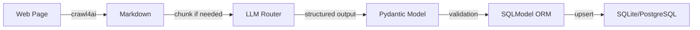

# PROJECT CONTEXT: UniAdmission Agent

## 1. Project Goal
Build a trusted, self-updating database of university admission requirements.

**Scope**: Multi-university crawler with intelligent depth exploration and context-aware parsing.

**Key Features**:
- Intelligent crawl depth with LLM-driven heuristic scouting
- Rolling window sequential chunking for context preservation
- Multi-provider LLM routing (Google Gemini, DeepSeek, OpenAI, VolcEngine)
- Stealth browsing with anti-detection mechanisms

---

## 2. Technology Stack

| Layer | Technology |
|:------|:-----------|
| **Crawling** | `crawl4ai` + `playwright` + `playwright-stealth` |
| **LLM** | Multi-provider routing: Gemini, DeepSeek, OpenAI, VolcEngine (豆包) |
| **Data Validation** | `pydantic` (v2) with strict schema enforcement |
| **Database** | `sqlmodel` (SQLite for dev, PostgreSQL ready) |
| **Migration** | `alembic` |
| **PDF Processing** | `pymupdf4llm` |
| **Environment** | `uv` package manager, Python 3.12+ |

---

## 3. Core Architecture

### 3.1 Intelligent Crawling Engine

**Two-tier strategy with dynamic depth**:

```
L1: Index Page (course list)
  ↓ extract_links() → concurrent chunks
L2: Detail Pages (individual programs)
  ↓ clean_markdown() → rolling window sequential chunks
  ↓ parse failure + --continue > 0 → Heuristic Scout
L3+: Scout-recommended pages
  ↓ LLM page type detection → INDEX or DETAIL
  ↓ Recurse with appropriate strategy
```

**Key mechanisms**:
- **Concurrent chunking** (index pages): Each link is independent, parallel LLM calls
- **Sequential rolling window** (detail pages): Context preserved via summary pass-through
- **Page type detection**: LLM classifies scout candidates as index/detail

### 3.2 Chunking Strategies

| Page Type | Strategy | Max Chunk Size | Context Handling |
|:----------|:---------|:---------------|:-----------------|
| Index (course list) | **Concurrent** | 30K chars | None needed (links independent) |
| Detail (single program) | **Sequential rolling window** | 20K chars | Previous chunk summary → next chunk |

**Rolling window flow**:
```
Chunk 1 + "no context" → data₁ + summary₁
Chunk 2 + summary₁    → data₂ + summary₂
Chunk N + summaryₙ₋₁  → dataₙ
→ Merge all dataᵢ
```

### 3.3 LLM Multi-Provider Routing

**RouterAgent** (`src/agents/factory.py`):
- Supports: Google Gemini, DeepSeek, OpenAI, VolcEngine (豆包)
- Configuration via environment variables
- Automatic fallback on provider failure

**Usage**:
```python
router = create_router()
response = router.generate(prompt, ResponseModel)
```

### 3.4 Data Flow



---

## 4. Directory Structure

```
uni-admission-agent/
├── src/
│   ├── agents/
│   │   ├── factory.py          # RouterAgent multi-provider LLM
│   │   ├── cleaner_agent.py    # LLMCleanerAgent (detail page parsing)
│   │   ├── providers.py        # LLM provider adapters
│   │   └── prompts/
│   │       ├── extract_links.txt       # Index page link extraction
│   │       ├── scout_links.txt         # Heuristic scout evaluation
│   │       ├── clean_chunk.txt         # Rolling window chunk parsing
│   │       └── detect_page_type.txt    # Page type classification
│   ├── core/
│   │   ├── environment.py      # Dependency checks (uv, playwright, LLM SDKs)
│   │   ├── parser.py           # HTML → Markdown utilities
│   │   └── pdf_processor.py    # PDF → Markdown conversion
│   ├── models/
│   │   ├── admission.py        # SQLModel database schemas
│   │   └── scraper_models.py   # Pydantic scraping output models
│   ├── scrapers/
│   │   ├── engine.py           # AdmissionScraper core logic
│   │   └── browser.py          # Stealth browser configuration
│   ├── storage/
│   │   ├── db_manager.py       # Database operations
│   │   ├── importer.py         # Excel → DB import
│   │   └── exporter.py         # DB → Excel export
│   └── main.py                 # CLI entry point
├── tests/                      # pytest test suite
├── data/
│   └── raw_markdown/           # Cached markdown downloads
├── migrations/                 # Alembic database migrations
├── pyproject.toml              # uv project config
└── PROJECT_CONTEXT.md          # This file
```

---

## 5. Key Design Patterns

### 5.1 Anti-Detection (Stealth Crawling)
- Random user agents via `fake_useragent`
- Random delays (0.5s - 2s) between actions
- `playwright-stealth` plugin for browser fingerprint evasion
- Exponential backoff retry with `tenacity`

### 5.2 Token Cost Control
- **Index pages**: Concurrent chunking (fastest)
- **Detail pages ≤ 20K**: Single-pass LLM call
- **Detail pages > 20K**: Sequential rolling window (context preserved, but slower)
- **Scout calls**: Max 5 per session (`MAX_SCOUT_CALLS`)
- **Page type detection**: Only during scout recursion (~550 tokens/call)

### 5.3 Error Handling
- All LLM calls wrapped in try-except with logging
- Failed pages collected in `_failed_urls` for scout evaluation
- Scout report printed if no data imported (human-in-the-loop)
- Database upsert with conflict resolution (unique on `name_en` + `university_id` + `academic_year`)

---

## 6. CLI Usage

### 6.1 Environment Check
```bash
uv run src/main.py check
```
Verifies: uv, playwright, database, LLM SDKs

### 6.2 Crawl Command
```bash
# Basic crawl (2 layers: index → detail)
uv run src/main.py crawl --name hku --year 2026 --url https://admissions.hku.hk/programmes

# With scout depth (2 + N layers)
uv run src/main.py crawl --name hku --year 2026 --url <URL> --continue 2
```

**Parameters**:
- `--name`: University slug (lowercase, alphanumeric + hyphens)
- `--year`: Academic year (numeric)
- `--url`: Starting URL (index page)
- `--continue`: Extra scout depth (default: 0)

### 6.3 Import/Export
```bash
# Import Excel → DB
uv run src/main.py import --file data.xlsx --name hku --year 2026

# Export DB → Excel
uv run src/main.py export --name hku --year 2026 --output programs.xlsx
```

---

## 7. Environment Variables

Required in `.env`:
```bash
# LLM Providers (configure at least one)
GOOGLE_GENAI_API_KEY=...
DEEPSEEK_API_KEY=...
OPENAI_API_KEY=...
VOLC_API_KEY=...          # 火山方舟 API Key
VOLC_MODEL_ID=doubao-pro-32k # 用于计费的模型id
VOLC_REGION=cn-beijing   # 服务区域 (默认: cn-beijing)

# LLM Routing Priority (comma-separated)
LLM_PROVIDER_PRIORITY=deepseek,google,openai,volcengine

# Database URL (optional, defaults to SQLite)
DATABASE_URL=sqlite:///./admission.db
```

---

## 8. Development Guidelines

### 8.1 Code Style (MANDATORY)
- **Pathlib only**: No string path concatenation
- **Type hints**: All functions must have type annotations
- **F-string logging**: `logger.info("Value: %s", value)` (not f-strings)
- **Pydantic validation**: All LLM outputs → Pydantic models
- **Max function length**: 60 lines (split if longer)

### 8.2 Testing
```bash
# Run all tests
uv run pytest

# Run with coverage
uv run pytest --cov=src

# Lint checks
uv run ruff check src/
uv run pyright src/
```

### 8.3 Adding New Universities
1. Add university to database via `db_manager.py`
2. Test crawl with `--continue 0` first
3. If parse fails, increase `--continue` gradually
4. Review Scout Report for unexplored high-value links

---

## 9. Troubleshooting

### Common Issues

**"No structured data extracted"**:
- Page is too complex → increase `--continue` depth
- Check Scout Report for recommended links
- Verify LLM provider is working (`uv run src/main.py check`)

**"Token limit exceeded"**:
- Page > 20K chars triggers sequential chunking (slower but safe)
- Reduce `MAX_DETAIL_CHARS` in `cleaner_agent.py` if needed

**"Browser detection / blocked"**:
- Ensure `playwright-stealth` is installed
- Check random delays in `browser.py`
- Verify user-agent rotation

---

## 10. Future Enhancements
- [ ] Async parallel detail page crawling
- [ ] Incremental updates (diff detection)
- [ ] Multi-language support (Chinese program names)
- [ ] Real-time monitoring dashboard
- [ ] Webhook notifications for deadline changes
