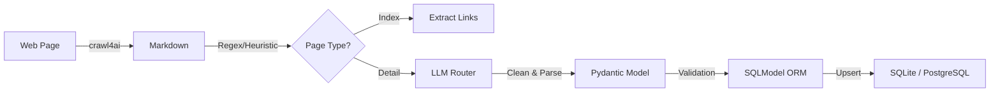

# PROJECT CONTEXT: UniAdmission Agent

> **Purpose of this document**: help a contributor quickly understand the
> system's architecture and tech stack well enough to make a code change.
> It intentionally does **not** cover installation, CLI usage, or
> configuration — that's README.md's job (the user-facing manual). If you're
> looking for "how do I run/use this", go there instead.

## 1. Project Goal
Build a trusted, self-updating database of university admission requirements.

**Scope**: Multi-university crawler with intelligent depth exploration and context-aware parsing.

**Key Features**:
- Intelligent crawl depth with Heuristic/Regex scouting (optimized for speed/cost)
- Rolling window sequential chunking for context preservation on large pages
- Multi-provider LLM routing (Google Gemini, DeepSeek, OpenAI, VolcEngine)
- **Deterministic crawl-strategy tier** (`src/services/crawl_strategy/`) — classifies an index page's layout, selects the matching extractor, and dispatches fetch via a ladder (server → client browser → API), skipping the LLM entirely for known/classifiable layouts
- **Phase 2 staged ingestion pipeline** with persisted job/task state and resume-from-stage
- **Phase 3 golden-sample quality system** with offline scoring + CI regression gate
- **Taxonomy-guided program-name resolution** (signal matching + conditional hint injection + high-confidence override)
- **Schema-based detail-page extraction** with selector learning, cached reuse, and field/full-page LLM fallback
- Stealth browsing with anti-detection mechanisms
- **Cookie consent auto-dismissal** with JS injection to prevent navigation hijacking
- **Resilient Pydantic validation** with field validators for LLM response edge cases
- **Chrome Extension** with interactive control, real-time monitoring, and database preview
- **Serve ↔ Client browser automation bridge** (`/clients/ws`) for MCP/REST-triggered user-side automation
- **Opt-in Agent Runtime layer** (`legacy` + `pydanticai`) with default-off safety gate
- **Agent chat entrypoint** (`POST /agent/chat`) with SSE event streaming on `/tasks/{id}/events`
- **Typed Agent Bridge contracts** (`src/agent_bridge`) decoupling runtime orchestration from core services
- **Single MCP toolset**: page-understanding tools always use the server's own configured LLM — no caller-selectable LLM mode (an earlier dual-toolset design was removed; see §3.8)
- **Runtime-aware MCP metadata**: provider resolution + client selection visibility
- **Policy profile precedence and normalization** (`request > client > server`) with warning output
- **Post-persist review-and-patch loop** with stable `program_id` correction path
- **Automatic rotated file logging** for backend CLI / server runs
- **Stand-alone Executable** build for easy distribution

---

## 2. Technology Stack

| Layer | Technology |
|:------|:-----------|
| **Crawling** | `crawl4ai` (v0.4+) + `playwright` + `playwright-stealth` |
| **LLM** | Multi-provider routing: Gemini, DeepSeek, OpenAI, VolcEngine (豆包) |
| **Data Validation** | `pydantic` (v2) with strict schema enforcement |
| **Database** | `sqlmodel` (**SQLite default**, PostgreSQL opt-in via `DATABASE_URL`) |
| **API / Control** | `fastapi`, `uvicorn`, `mcp` (Model Context Protocol) |
| **Agent Runtime** | LLM-driven loop (s01–s12) + `pydantic` typed contracts + runtime factory (`legacy` / `pydanticai`) |
| **Client Bridge** | FastAPI WebSocket + `websockets` runtime client |
| **Logging** | stdlib `logging` + `loguru` rotated file sink |
| **CLI** | `typer` |
| **Build** | `pyinstaller` (Backend + Client), `npm` (Extension) |
| **Migration** | `alembic` |
| **Env Management** | `uv` package manager, Python 3.12+ |

---

## 3. Core Architecture

### 3.1 Intelligent Crawling Engine (Hybrid)

**Strategy**: Three dispatch tiers, tried in priority order (`_execute_agent_job`):

0.  **Deterministic crawl-strategy tier** (`src/services/crawl_strategy/`) — for
    known/classifiable index-page layouts. `classifier.py` scores an index
    page's markdown against several extractors (`extractors.py`:
    heading-link, inline-degree, merged-columns, blob, text-heading,
    cityu-table) and — above a confidence threshold — picks one
    deterministically, skipping the LLM entirely for index-page link
    discovery. `registry.py` pins proven fetch-mode + extractor combos per
    domain (`strategy_direct` mode); unknown domains fall through to
    automatic classification, and successful LLM-driven crawls get persisted
    into `learned_cache.py`'s `strategy_cache.json` for reuse
    (`learned_cache` mode, skips the agent loop on a cache hit).
    `fetch_ladder.py` / `fetch_adapters.py` dispatch the actual fetch via a
    ladder: server fetch → client browser → API. `discovery.py` +
    `orchestrator.py` wire all of this into `/agent/run`.
1.  **Regex / Heuristic** (fallback: `agent_loop` mode, unknown domains):
    used for high-volume tasks (link extraction, page type detection) to
    save tokens and latency.
2.  **LLM**: reserved for complex tasks (content cleaning, structured data
    extraction) and as the last-resort orchestrator for domains the
    deterministic tier can't classify.

```
L1: Index Page (course list)
  ↓ crawl_strategy classifier (known layout) → deterministic extractor
  ↓ else: Regex Link Extraction → concurrent chunks
L2: Detail Pages (individual programs)
  ↓ LLM Clean & Parse (Rolling Window)
  ↓ parse failure + --continue > 0 → Scout
L3+: Scout-recommended pages
  ↓ Heuristic Page Type Detection (Link Count/Content Signals)
  ↓ Recurse
```

#### 3.1.1 Schema-Based Detail Extraction

For agent-driven index crawls, the system now short-circuits repeated LLM extraction work:
- page 1 uses the normal LLM cleaner path to obtain structured fields
- `SchemaLearner` infers reusable CSS selectors and stores a `SelectorSchema` under `.adm-agent/schemas/`
- sibling detail pages reuse those selectors through `SelectorExtractor`
- when selector coverage drops, `FallbackHandler` chooses field-level repair or full-page LLM fallback
- degraded schemas are automatically deprecated and relearned

### 3.2 Frontend & API

The system exposes a REST API and MCP server for external control.
-   **Server**: `src/api/server.py` (FastAPI)
-   **Protocol**: HTTP + SSE (Server-Sent Events) for real-time logs
-   **Agent chat**: `POST /agent/chat` returns a task id; `GET /tasks/{id}/events` streams thinking/tool/summary events
-   **Frontend**: Vite/TypeScript-based UI in `frontend/` directory. One bundle, two delivery forms — Chrome extension (`frontend/dist/` loaded unpacked) and Web UI (same `frontend/dist/` served by FastAPI at `/ui/`). Source layout: `frontend/src/{shared,extension,web}/` — `shared/` is used by both, `extension/` is extension-only (background service worker), `web/` reserved for web-only entries.
    -   Connects to `http://localhost:8910`
    -   Displays real-time logs and token usage
    -   Manages crawler configuration
    -   **Database Preview**: Browse stored programs with filtering by university/year
    -   **Two-phase crawl**: Analyze index pages → select links → crawl detail pages
    -   **Per-task taxonomy controls**: enable/disable matching, low/high thresholds, top-k hints, override toggle
    -   **Export to Excel**: Download program data via REST API

### 3.3 Data Flow



### 3.4 Phase 2 Execution Pipeline (Decoupled + Resumable)

The crawl execution layer is staged and persisted:
- `fetch_raw`
- `extract_structured`
- `validate_rules`
- `persist_versioned`

Each run creates an `ingestion_job` with stage-level `ingestion_task` records, enabling:
- bounded retry and poison handling
- deterministic stage trace
- resume from the first unfinished stage or an explicit stage override
- reuse of successful upstream stage outputs

### 3.5 Phase 3 Quality System (Seed)

The project includes a seed quality framework for offline regression checks:
- golden manifest: `golden_samples/manifest.json`
- snapshot collector: `scripts/collect_golden_samples.py`
- scoring runner: `scripts/score_golden_samples.py`
- CI gate: `.github/workflows/ci.yml` fails when quality threshold is not met

Current seed set includes 8 benchmark universities (`golden_samples/manifest.json`):
UCL, Manchester, Leeds, PolyU, CityU, CUHK, EdUHK, Lingnan — each added via a
"battle-test" round (real crawl → find bugs → fix → lock in a golden-sample
regression fixture). See README.md's crawl-strategy registry table for
per-domain fetch mode / extractor kind.

### 3.6 Taxonomy Runtime Matching

At server startup, taxonomy seed sync is attempted from:
- `golden_samples/program_names/cleaned_programs_names.json`

During `extract_structured`, detail-page name resolution now uses:
- signal priority: selected anchor text → URL tokens → heading fallback
- low-threshold gating for cleaner prompt hint injection
- high-threshold gating for optional canonical-name override
- trace output in `extra_metadata.taxonomy_match`

Per-request overrides are supported on `/crawl`:
- `taxonomy_enabled`
- `taxonomy_low_threshold`
- `taxonomy_high_threshold`
- `taxonomy_hint_top_k`
- `taxonomy_override_enabled`
- `selected_link_texts`

### 3.7 Serve-Client Browser Automation

`crawl` now supports browser provider selection:
- `browser_provider`: `auto` / `server` / `client`
- `client_id`: optional target connected client
- `strict_client`: fail when no client is available (no fallback)

`serve` maintains connected user-side clients:
- `GET /clients` for live client status
- `WS /clients/ws` for register / heartbeat / rpc request/response

Client dispatch flow:
1. External caller uses existing `crawl` (REST or MCP)
2. `browser_provider=auto|client` resolves through connected client when available
3. Client executes external browser command (e.g. client), returns HTML/`detail_pages_batch`
4. Existing ingestion pipeline consumes returned payload (no extension dependency required)

### 3.8 MCP Toolset + Decision Policy

MCP exposes one toolset, always registered: `analyze`, `crawl`, `crawl_detail_batch`, `ingest`, `db_query`, `runtime_status`, `program_patch`, `program_patch_batch`, `help`. Page-understanding tools (`analyze`, `crawl`, `crawl_detail_batch`) always use the server's own configured LLM.

(An earlier design registered a parallel `*_internal_llm` toolset gated on LLM availability, doubling the tool count. Removed: 7 of 9 variants were byte-identical aliases with zero behavioral difference from their base counterpart, and the two that did differ branched between the server's LLM and a deterministic heuristic — never actually "the caller's LLM does it" despite the naming — so the duplication cost tool-surface complexity for no real capability.)

Runtime introspection:
- `runtime_status` exposes `client_available`, `client_count`, `client_ids`, `internal_llm_available`, `default_browser_provider_resolved`
- Crawl/analyze payloads include `resolved_browser_provider` and `client_id_used`

Interactive decision policy for index pages:
- Year is mandatory before crawl execution (`requires_user_input`, `missing_fields=["year"]`)
- Taxonomy candidate keep threshold: `0.75`
- Taxonomy auto-run threshold: `0.92`
- Auto-run only when retained candidate count `<= 10`; otherwise require user review

Review-and-correction loop:
- Crawl responses include `review_token` and ordered `review_items` with stable `program_id`
- User corrections are applied via `program_patch` / `program_patch_batch`
- Batch patch returns partial failures without aborting successful updates

### 3.9 Default Agent Runtime (PydanticAI Evolution)

Agent orchestration is the default user-facing runtime layer and does not replace
existing crawl/analyze entrypoints.

Enablement and runtime selection:
- Default: enabled (`AGENT_ENABLED=true` when unset)
- CLI startup path: `serve` and `serve-install` run in agent mode by default
- Runtime mode: `AGENT_RUNTIME=legacy|pydanticai` (default `pydanticai`)
- Model mode gates:
  - `AGENT_ALLOW_INTERNAL_LLM=true|false`
  - `AGENT_ALLOW_EXTERNAL_LLM=true|false`

Entrypoints:
- REST: `POST /agent/run`
- REST chat: `POST /agent/chat`
- REST confirm: `POST /agent/review/confirm`
- MCP: `agent_run` and `agent_review_confirm` tools (registered by default unless agent runtime is explicitly disabled)

Safety and fallback:
- `PydanticAIRuntime` failure automatically falls back to `LegacyRuntime`
- Base REST/MCP tools remain unchanged when agent runtime is explicitly disabled
- Streaming boundary:
  - `/tasks/{id}/events` provides SSE lifecycle updates for agent tasks.
  - The final user-visible summary may emit `summary_delta` events or gracefully fall back to one-shot text.
  - Structured LLM calls remain on the synchronous `generate()` path, including cleaner extraction, page-type classification, and program-name resolution.

#### Agent Capability Stack (s01–s12)

The `pydanticai` runtime drives an LLM-controlled agent loop (`src/agent_runtime/loop.py`)
with the following capability layers:

| # | Capability | Module | Description |
|:--|:-----------|:-------|:------------|
| s01 | Agent Loop | `loop.py` | Core `while True` loop — LLM decides tool calls, exits when `stop_reason != "tool_use"` |
| s02 | Tool Dispatch | `skills/registry.py` | SkillRegistry dispatch map with Pydantic-typed `SkillDef` inputs |
| s03 | Todo Manager | `todo.py` | In-memory task tracker, exactly-one-in-progress rule, nag reminder every 3 iterations |
| s04 | Subagents | `loop.py` | `task` tool spawns child `agent_loop()` with fresh context, no recursion |
| s05 | Skill Loading | `skills/skill_loader.py` | Layer 1: short descriptions in system prompt; Layer 2: `load_skill` returns full SKILL.md |
| s06 | Context Compact | `context_compact.py` | micro_compact (replace old results), auto_compact (LLM summary at >50k tokens), manual `compact` tool |
| s07 | Task System | `task_manager.py` | File-persisted task DAG with `blockedBy`/`blocks` edges, auto-unblock on completion |
| s08 | Background Tasks | `background.py` | `asyncio`-based background skill execution with notification queue drain |
| s09 | Agent Teams | `team.py` | Persistent teammates with own agent loops, JSONL file-based `MessageBus` inboxes |
| s10 | Team Protocols | `protocol.py` | Request-response FSM (pending→approved/rejected) with `request_id` correlation |
| s11 | Autonomous Agents | `team.py` | WORK↔IDLE lifecycle, idle polling (inbox + unclaimed tasks), 60s idle timeout |
| s12 | Worktree Isolation | `worktree.py` | Git worktree per task, `EventLog` (events.jsonl), index.json registry |

Built-in tools (handled directly in `loop.py`, not through SkillRegistry):
- `todo`, `load_skill`, `compact` — planning & knowledge
- `task_create`, `task_update`, `task_list`, `task_get` — task DAG
- `bg_run`, `bg_check` — background execution
- `team_spawn`, `team_send`, `team_inbox` — team communication
- `protocol_request`, `protocol_respond`, `protocol_status` — coordination protocols
- `idle`, `claim_task` — autonomous lifecycle
- `task` — subagent spawning
- `worktree_create`, `worktree_run`, `worktree_list`, `worktree_keep`, `worktree_remove` — isolation

LLM providers: DeepSeek, Custom, VolcEngine via `resolve_openai_client()` (OpenAI-compatible).

Onhold batch-review behavior:
- Index candidates are split by confidence policy (`auto-run` vs `onhold`).
- Low-confidence candidates are persisted as `onhold_items` sorted by confidence descending and indexed per task (`1..N`).
- Runtime returns `status=wait_user_selection` when onhold items exist.
- Confirmation accepts dynamic index input (`selection_text` or `selected_indices`); unselected onhold items are discarded by default.

Policy profile behavior:
- Merge precedence: `request overrides > client profile > server defaults`
- Invalid values are normalized with `warnings` in merge result
- Client runtime can attach local `policy_profile` to browser RPC payloads

Runtime logging behavior:
- backend CLI / server startup enables rotated timestamped `.txt` file logs automatically
- dev/source mode writes logs to the current working directory
- frozen builds write logs beside the executable
- `adm-agent-client start-install` separately writes daemon logs to `~/.adm-agent-client/client.log`

---

## 4. Build & Distribution System

The project supports a fully automated build pipeline to generate standalone artifacts.

### 4.1 Artifacts
-   **Backend Engine**: `adm-agent` (Single-directory executable via PyInstaller)
-   **Client Engine**: `adm-agent-client` (Single-directory executable via PyInstaller)
-   **Frontend**: `frontend/uni-admission-extension.zip` (Chrome Extension form) — same `frontend/dist/` is also served as the Web UI by the backend at `/ui/`

### 4.2 Build Process
Managed by `scripts/build_dist.py`:
1.  `npm run build` (Extension) → `dist/` + `.zip`
2.  `pyinstaller adm-agent.spec` (Backend) → `dist/adm-agent/`
3.  `pyinstaller adm-agent-client.spec` (Client) → `dist/adm-agent-client/`
4.  **Assembly** → `release/` folder with everything needed.

### 4.3 Path Resolution
`src/core/paths.py` handles runtime path resolution transparently:
-   **Dev Mode**: Uses source tree (`src/`, `data/`).
-   **Frozen Mode**: Uses `sys._MEIPASS` for bundled assets and `~/.uni-agent/` for writable data.

---

## 5. Directory Structure

```
uni-admission-agent/
├── src/
│   ├── agent_bridge/       # Typed bridge contracts for serve/client orchestration
│   ├── agent_runtime/      # LLM-driven agent loop (s01–s12), skills, team, tasks, worktree
│   ├── agents/             # LLM logic (Router, Cleaner)
│   ├── api/                # FastAPI + MCP Server
│   ├── cmd/                # CLI Entry Points
│   ├── core/               # Core utilities (paths, env, config, file logging)
│   ├── models/             # DB & Pydantic schemas
│   ├── scrapers/           # Crawling logic (Engine, Browser)
│   ├── services/           # Business logic (Crawler Service)
│   │   └── crawl_strategy/ # Deterministic tier: classifier, registry, extractors,
│   │                       #   discovery, orchestrator, fetch_ladder/fetch_adapters,
│   │                       #   learned_cache
│   ├── storage/            # DB Manager, Import/Export
│   └── utils/              # Text/PDF processors
├── frontend/               # Vite/TS source for Chrome extension + Web UI
├── scripts/                # Build & Maintenance scripts
├── tests/                  # Pytest suite
├── data/                   # Default data storage (dev mode)
├── migrations/             # Alembic migrations
├── adm-agent.spec          # PyInstaller config
├── adm-agent-client.spec   # PyInstaller config (client)
├── pyproject.toml          # Project config
└── README.md               # User guide
```

---

## 6. Where to Go Next

- **Running / installing / configuring the project** (CLI commands, `.env`
  setup, Chrome extension config, database backends): README.md is the
  single source of truth — don't duplicate it here.
- **Developer setup, tests, git hooks, CI**: README.md § "Developer Setup" /
  "Testing & Coverage" / "CI/CD".
- **Making a real crawl work for a new university** ("battle-test" rounds —
  the workflow used for the UCL/Manchester/Leeds/PolyU/CityU/CUHK/EdUHK/Lingnan golden
  samples in §3.5): not yet formally written up anywhere; reconstruct from
  `git log` on `golden_samples/manifest.json` and past `feat/battle-test-*`
  branches until this gets its own doc.
- **Historical changelog**: not tracked as a maintained document — use
  `git log` / merged PR history instead. (A prior `change_log.md` and this
  file's own "Recent Updates" section both drifted stale and were removed on
  2026-08-07 for exactly that reason — don't reintroduce a hand-maintained
  changelog without a plan to keep it in sync.)
