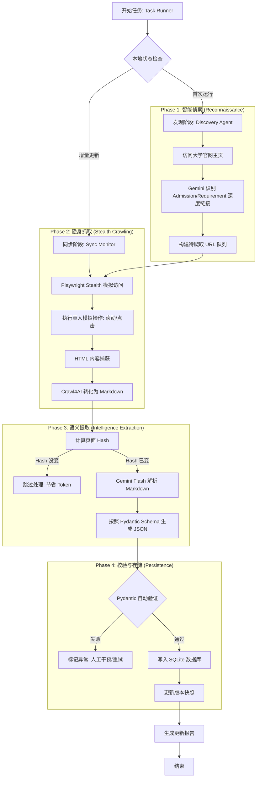

# UniAdmission Agent

**Autonomous LLM-powered engine for aggregating and synchronizing global university admission requirements into a structured database.**

## 🎯 Overview
This project automates the collection of admission criteria from world-renowned universities. It uses an **Agentic Workflow** to handle dynamic web content, bypass anti-detection mechanisms, and transform unstructured web data into verified JSON schemas.

## 🛠 Tech Stack
- **Engine:** Python 3.12+ (managed by `pyenv`)
- **Intelligence:** Gemini 2.0 Flash / DeepSeek / VolcEngine (豆包)
- **Automation:** Playwright with Stealth Plugin
- **Extraction:** Crawl4AI / Firecrawl (Markdown-first approach)
- **Validation:** Pydantic (Strongly typed schemas)
- **Storage:** SQLite

## 🚀 Getting Started
1. `pyenv local 3.12.0`
2. `python -m venv venv && source venv/bin/activate`
3. `pip install -e .`
4. Copy `.env.example` to `.env` and add your API keys.
4. Copy `.env.example` to `.env` and add your API keys.


## 📖 Usage
Run the main CLI to interact with the engine:

```bash
# General environment check
uv run src/main.py check

# Start the crawling task (Placeholder for now)
uv run src/main.py run

# Import Excel data (Strict Regex only by default)
# Arguments:
#   --name: University slug (lowercase, numbers, hyphens only, e.g., hku)
#   --year: Academic year (e.g., 2026)
#   --file: Path to the XLSX file
#   --llm:  Enable LLM analysis for missing data (optional)
# Example:
uv run src/main.py import --name hku --year 2026 --file example/hku-26-27.xlsx

# Import Excel data with LLM Fallback
uv run src/main.py import --name hku --year 2026 --file example/hku-26-27.xlsx --llm

# Export data to Excel
# Arguments:
#   --name:   University slug
#   --output: Output file path
#   --year:   Academic year (optional, defaults to all years)
# Example:
uv run src/main.py export --name hku --output hku_export.xlsx --year 2026

# Crawl a URL and import admission data
# Arguments:
#   --name:      University slug (lowercase, numbers, hyphens only)
#   --year:      Academic year (e.g., 2026)
#   --url:       Starting URL to crawl
#   --continue:  Extra depth for LLM-driven scouting (default: 0)
# Examples:
uv run src/main.py crawl --name hku --year 2026 --url https://admissions.hku.hk/programmes
uv run src/main.py crawl --name hku --year 2026 --url https://admissions.hku.hk/programmes --continue 2

# Check database status
uv run src/main.py status
```

## 🤖 Agentic Principles
- **Stealth First:** Never trigger bot detection; emulate human behavior.
- **Markdown-Centric:** Convert HTML to Markdown before LLM processing to save tokens.
- **Verified Output:** All data must pass Pydantic validation before being committed to the database.

## Action trail
